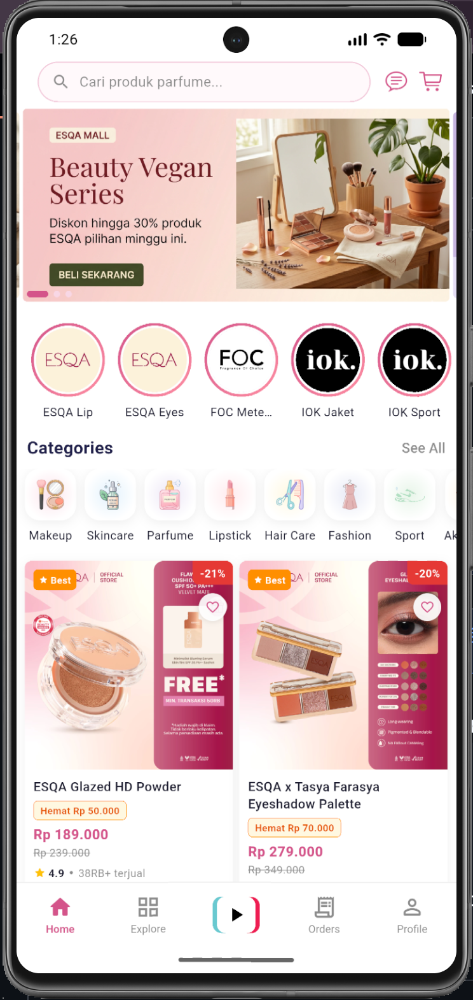
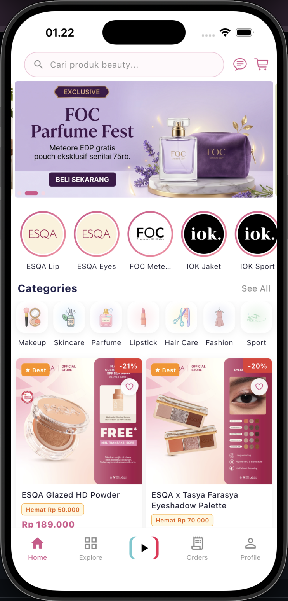

# Parela

**Parela** adalah demo aplikasi **marketplace beauty/kosmetik** berbasis Flutter. Proyek ini dibuat sebagai showcase e-commerce mobile dengan tampilan modern bergaya TikTok Shop, lengkap dengan feed video, chat, dan sistem transaksi.

> ⚠️ **Status: Demo/Prototype.** Seluruh data yang tampil (produk, seller, order, notifikasi, dll) masih berupa **mock/placeholder**. Belum ada koneksi ke backend/API sungguhan.

## 📲 Download APK

Coba langsung aplikasinya di HP Android kamu — pilih sesuai arsitektur perangkat (kalau tidak yakin, pakai **arm64-v8a**, cocok untuk hampir semua HP Android modern):

| Arsitektur | Link Download |
|---|---|
| arm64-v8a (rekomendasi, HP modern) | [app-arm64-v8a-release.apk](https://github.com/pareraamas/parela/raw/main/releases/app-arm64-v8a-release.apk) |
| armeabi-v7a (HP lama/32-bit) | [app-armeabi-v7a-release.apk](https://github.com/pareraamas/parela/raw/main/releases/app-armeabi-v7a-release.apk) |
| x86_64 (emulator/tablet Intel) | [app-x86_64-release.apk](https://github.com/pareraamas/parela/raw/main/releases/app-x86_64-release.apk) |

> Karena APK ini belum ditandatangani oleh Play Store, Android akan menampilkan peringatan "unknown sources" — aktifkan **Install from unknown sources** untuk browser/file manager yang digunakan saat instalasi.

<p align="center">
  
  
</p>

## Fitur Utama

- 🏠 **Home** — banner promo, kategori, story, rekomendasi produk
- 🔍 **Explore** — pencarian & jelajah produk lintas kategori
- 🎥 **Video Feed** — feed video full-screen bergaya TikTok untuk konten produk/seller
- 🛒 **Keranjang & Checkout** — kelola cart, alamat, metode pembayaran
- 📦 **Transaksi** — daftar order, detail & tracking pesanan
- 💬 **Chat** — percakapan dengan seller
- 🔔 **Notifikasi** — update pesanan & promo
- 👤 **Profil** — akun, alamat, metode pembayaran
- 🏪 **Halaman Seller/Toko** — profil & katalog produk seller

## Tech Stack

- **Flutter** SDK `^3.10.9`
- **GetX** `^4.7.3` — state management, dependency injection, navigation
- **shared_preferences** — persistensi cart & wishlist lokal
- **cached_network_image**, **carousel_slider**, **flutter_staggered_grid_view** — UI & media
- **video_player** — feed video
- **flutter_local_notifications** — notifikasi lokal
- **qr_flutter** — QR code (pembayaran/tracking)
- Platform: Android, iOS, Web, macOS, Windows, Linux

## Arsitektur

Proyek ini menggunakan pola **GetX + Repository Pattern**:

```
View → Controller → Repository (abstract) → Mock/API Implementation
```

Karena seluruh akses data controller melewati layer repository (bukan langsung ke mock data), nantinya integrasi backend cukup dilakukan dengan mengganti implementasi `Mock*Repository` menjadi `Api*Repository` **tanpa perlu mengubah controller maupun view**.

### Struktur Folder

```
lib/
├── main.dart
└── app/
    ├── bindings/
    │   └── app_binding.dart          ← Registrasi semua repository (dijalankan saat app start)
    ├── data/
    │   ├── mock/
    │   │   └── mock_content.dart     ← Satu-satunya sumber mock data
    │   ├── models/                   ← Data models (typed)
    │   └── repositories/
    │       ├── *.dart                ← Abstract interfaces
    │       └── impl/
    │           └── mock_*.dart       ← Mock implementations
    ├── modules/
    │   └── <module>/
    │       ├── bindings/
    │       ├── controllers/
    │       └── views/
    ├── routes/
    │   ├── app_pages.dart
    │   └── app_routes.dart
    ├── services/
    │   └── storage_service.dart      ← SharedPreferences wrapper
    └── theme/
        └── app_colors.dart
```

### Repository yang Tersedia

| Abstract | Mock Implementation | Isi Data |
|---|---|---|
| `ProductRepository` | `MockProductRepository` | products, categories, banners, stories, reviews |
| `UserRepository` | `MockUserRepository` | user, addresses, payment methods |
| `OrderRepository` | `MockOrderRepository` | orders |
| `NotificationRepository` | `MockNotificationRepository` | notifications |
| `SellerRepository` | `MockSellerRepository` | sellers |
| `CartRepository` | `MockCartRepository` | cart (kombinasi MockContent + StorageService) |

Untuk menghubungkan ke API sungguhan: buat `ApiXRepository implements XRepository`, lalu daftarkan di `AppBinding` menggantikan `MockXRepository`.

### Main Shell (Bottom Navigation, 5 Tab)

`MainView` (`/main`) menggunakan `IndexedStack` dengan 5 tab:

| Index | Tab | Keterangan |
|---|---|---|
| 0 | Home | Beranda |
| 1 | Explore | Jelajah/pencarian |
| 2 | Video | Full-screen, gaya TikTok, background gelap |
| 3 | Transaction | Daftar order |
| 4 | Profile | Akun pengguna |

Cart & Chat diakses melalui ikon di `AppHeader` (bukan di bottom nav).

## Tema Warna

```dart
const kBackground   = Color(0xFFFCEDF3); // pink sangat muda (scaffold bg)
const kPrimary      = Color(0xFFD4548A); // pink utama
const kPrimaryLight = Color(0xFFF8D7E5); // pink muda (chip, highlight)
const kBadge        = Color(0xFF3B82F6); // biru (badge angka)
const kText         = Color(0xFF1A1A2E); // hitam kebiruan
const kSubtext      = Color(0xFF8C8C8C); // abu-abu
```

Selalu import dari `package:parela/app/theme/app_colors.dart`.

## Cara Menjalankan

1. Pastikan Flutter SDK `^3.10.9` sudah terpasang.
2. Install dependencies:
   ```bash
   flutter pub get
   ```
3. Jalankan aplikasi:
   ```bash
   flutter run
   ```

### Perintah Lain

```bash
flutter analyze          # wajib clean (No issues found) sebelum commit
flutter build apk        # build Android release
flutter build ios        # build iOS release
```

## Roadmap

- [ ] Integrasi backend/API menggantikan seluruh `Mock*Repository`
- [ ] Autentikasi & manajemen sesi pengguna sungguhan
- [ ] Payment gateway
- [ ] Push notification (server-driven)

## Kontribusi & Aturan Pengembangan

Proyek ini mengikuti sejumlah aturan arsitektur yang didokumentasikan lebih detail di [`CLAUDE.md`](CLAUDE.md), di antaranya:

1. Jalankan `flutter analyze` setelah setiap perubahan — harus **No issues found**.
2. Controller/View **tidak boleh** mengakses `MockContent` atau `StorageService` secara langsung — selalu lewat repository.
3. Setiap modul baru wajib memiliki `binding/`, `controllers/`, dan `views/`.
4. Route baru wajib didaftarkan di `app_routes.dart` (Routes + `_Paths`) **dan** `app_pages.dart`.
5. Warna baru ditambahkan ke `app_colors.dart`, jangan hardcode di widget.

## Lisensi

Proyek ini adalah demo pribadi untuk keperluan portofolio/showcase.
